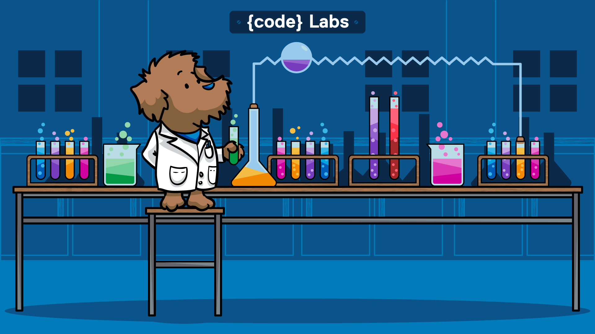

# {code} Labs

**stateful and persistent applications in containers that work...**

## Environment QuickStart

Quickly deploy an environment to begin application testing. Each 
has key pieces of technology that make them unique.

1. [Deploy VirtualBox with Docker Machine and Install REX-Ray](https://github.com/codedellemc/labs/tree/master/setup-virtualbox-dockermachine)
    - Use [Docker Machine](https://github.com/docker/machine) to deploy a VirtualBox host that is installed and
    configured with the latest and stable Docker Engine. Follow the directions
    to install REX-Ray using `curl | sh` and learn how to write a properly
    formatted configuration file. This environment will use the VirtualBox
    driver for REX-Ray to allow stateful applications to persist data.
2. [3-Node ScaleIO Environment Using Vagrant](https://github.com/codedellemc/labs/tree/master/setup-scaleio-vagrant)
    - The Vagrant file provided will use VirtualBox to create three (3)
    hosts. Each host will have ScaleIO (a software that turns DAS
    storage into shared and scale-out block storage) installed and configured.
    The hosts will also automatically install and configure Docker Engine and
    REX-Ray. This gives a fully configured environment ready to test stateful
    applications and clustering functionality using the ScaleIO driver for
    REX-Ray.
3. [3-Node ScaleIO + 3-Node Apache Mesos Cluster with Marathon on AWS](http://scaleio-framework.readthedocs.io/en/latest/user-guide/demo/)
    - Use an [AWS Cloudformtion](https://aws.amazon.com/cloudformation/)
    template to deploy two (2) clusters in AWS. The first cluster is a three (3)
    node ScaleIO environment which will be used by REX-Ray as the storage
    platform. A second cluster is a three (3) node Apache Mesos cluster fully
    configured with Marathon ready to accept requests for scheduling containers.
    Follow this with [Application Demo #3](https://github.com/codedellemc/labs/tree/master/demo-persistence-with-postgres-marathon-docker)
    - **GO ADVANCED**
        + Take it to the next level by exploring features of performing a custom
        ScaleIO configuration and installation. This process will take the
        existing Mesos Agent Nodes, add additional storage, and install all
        the SDS components to add more storage to the existing ScaleIO cluster
        based on your pool and domain configuration settings. Try it at the 
        [Custom ScaleIO Framework Deployment](https://github.com/codedellemc/labs/tree/master/setup-scaleio-aws-custom)

## Application Demo

1. [Storage Persistence with Postgres using REX-Ray](https://github.com/codedellemc/labs/tree/master/demo-persistence-with-postgres-docker)
    - Learn how to read a Dockerfile to know which paths need persistent data.
    Manually deploy a Docker Postgres container and create a few tables to write
    data. Destroy the container and start a new container on a different host to
    see the data persist.
2. [Storage Persistence and Failover with Minecraft using REX-Ray and Docker Swarm Mode](https://github.com/codedellemc/labs/tree/master/demo-persistence-with-minecraft-docker)
    - Take a set of nodes and cluster them together using [Docker Swarm Mode](https://docs.docker.com/engine/swarm/)
    which allows distributed computing, reconciliation of failed hosts, and
    extended networking functionality. Play a game of Minecraft to create an
    inventory of data to persist. Turn off the Docker service to watch Docker
    Swarm Mode along with REX-Ray redeploy the container on a new host to keep
    inventory intact.
3. [Storage Persistence with Postgres using Mesos, Marathon, Docker, and REX-Ray](https://github.com/codedellemc/labs/tree/master/demo-persistence-with-postgres-marathon-docker)
    - Use the supplied application spec for Marathon to deploy a Postgres
    service to Mesos. Use the restart button to redeploy the Postgres service on
    a new host and see the data persist.
4. [Kubernetes with libstorage integration on AWS](https://github.com/codedellemc/labs/tree/master/demo-kubernetes-with-libstorage)
    - Take a test drive with a proposed feature for Kubernetes using libStorage
    for persistent applications. Start from scratch with the complete setup
    needed to run a functioning fork of Kubernetes on AWS. Then explore the
    different types of volume architectures available to Kubernetes pods to
    persist applications.

## Video

1. [REX-Ray and Modern Data Persistence - Q3 2016](https://www.youtube.com/watch?v=EnMsUKSsK0s&list=PLbssOJyyvHuWiBQAg9EFWH570timj2fxt&index=2)

## Guidelines for Contributing a Demo

1. Create a new folder with the title of your demo
2. Add all relevant code and step-by-step instructions for completing the demo
3. Remember that these are quick "demos" and not "tutorials"
4. Create a README.md file for each demo to display on GitHub that lays out the instructions for completing your demo from start to finish.
5. Screenshots are encouraged. 

### Contribution Rules

Create a fork of the project into your own repository. Make all your necessary changes and create a pull request with a description on what was added or removed and details explaining the changes in lines of code. If approved, project owners will merge it.

### Support

Please file bugs and issues on the GitHub issues page for this project. This is to help keep track and document everything related to this repo. For general discussions and further support you can join the [{code} by Dell EMC Community slack channel](http://community.codedellemc.com/). The code and documentation are released with no warranties or SLAs and are intended to be supported through a community driven process.