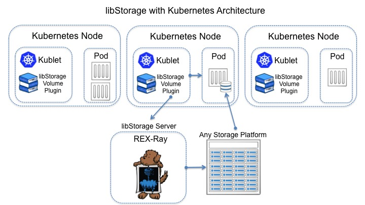

# DEPRECATED - DO NOT USE

# Exploring Kubernetes with libStorage Persistent Volumes on AWS

The [libStorage](http://libstorage.readthedocs.io/en/stable/) integration with 
[Kubernetes](http://kubernetes.io/) has been submitted by the [{code} team](https://thecodeteam.com/) as a [Pull Request #28599](https://github.com/kubernetes/kubernetes/pull/28599) for consideration by the Kubernetes project.
Until this is merged into the Kubernetes tree, this procedure can be utilized to evaluate Kubernetes using libStorage enabled external volume mount support.

This document aspires to be an homage to [@kelseyhightower](https://twitter.com/kelseyhightower) ‘s brilliant Kubernetes the Hard Way [project](https://github.com/kelseyhightower/kubernetes-the-hard-way). It's not a model for production deployment, but for evaluation.

This tutorial goes from beginning to end to better understand all the
components and configuration involved. This process will build Kubernetes from
source, manually installing the build tools and libStorage. This exercise should
take 45 minutes or less.

Kubernetes and libStorage can run on many cloud and physical platforms with
multiple host OS options and support a growing number of storage
platforms. libStorage allows automation to deal with the combination of
environment options.

**NOTE:** Non-AWS choices of computing and storage platforms are identical to
this tutorial. libStorage is designed to make it feasible to add, swap
or migrate workloads and providers at many levels.

**NOTE: This lab only uses a single node configuration. A multi-node tutorial
is currently in progress of testing.**


### Prerequisites

- An Amazon AWS account with:
    - an ssh key pair for remote login
    -  An Access Key for API access
        - Access Key ID
        - Secret Access Key 

### Step 1: Deploy an EC2 AMI (VM)

1. Choose EC2 from the AWS console dashboard, an `Launch an Instance`.
2. The following directions are all based on Ubuntu. Use the **Ubuntu Server
16.04 LTS (HVM), SSD Volume Type**. 64-bit. The ami number varies by region. A
`t2.large` instance type is recommended because the Kubernetes build can utilize over 4GB of memory. (An `m4.large` could also be utilized.)
3. Configure instance details to set the Root volume to `40GB`. Other settings can be left as default.
4. Select your ssh key and launch.
5. Optionally: name the instance `kubernetes-libstorage` while it initializes.

### Step 2: Install Go

Login to the VM using the tool of your choice. The AMI's user and password will be `ubuntu`.

Execute these commands (copy and paste multiple lines at a time):

```
cd ~
curl https://storage.googleapis.com/golang/go1.6.3.linux-amd64.tar.gz | tar xvz
sudo chown -R root:root ./go/ 
sudo mv go /usr/local
echo "export GOPATH=$HOME/work" >> .profile 
echo "export PATH=$PATH:/usr/local/go/bin:$HOME/work/bin" >> .profile
source .profile
```

### Step 3: Install Docker

```
sudo apt-key adv --keyserver hkp://p80.pool.sks-keyservers.net:80 --recv-keys 58118E89F3A912897C070ADBF76221572C52609D
echo "deb https://apt.dockerproject.org/repo ubuntu-xenial main" | sudo tee /etc/apt/sources.list.d/docker.list
sudo apt-get update
sudo apt-get install -y docker-engine
```

### Step 4: Install etcd

```
curl -L https://github.com/coreos/etcd/releases/download/v3.0.13/etcd-v3.0.13-linux-amd64.tar.gz | tar xvz
sudo chown -R root:root ./etcd-v3.0.13-linux-amd64/
sudo mv etcd-v3.0.13-linux-amd64/ /usr/local/
sudo ln -s /usr/local/etcd-v3.0.13-linux-amd64/etcd /usr/local/bin/etcd
sudo ln -s /usr/local/etcd-v3.0.13-linux-amd64/etcdctl /usr/local/bin/etcdctl
```

### Step 5: Install build tools: g++, make, mercurial, unzip, 

```
sudo apt-get install -y g++ make mercurial  unzip
go get -u github.com/tools/godep
go get -u github.com/jteeuwen/go-bindata/go-bindata
```

### Step 6: Git Checkout the libStorage fork of Kubernetes from GitHub

```
mkdir -p $GOPATH/src/k8s.io && cd $GOPATH/src/k8s.io
git clone https://github.com/vladimirvivien/kubernetes.git
cd kubernetes
git remote add upstream https://github.com/kubernetes/kubernetes.git
git checkout -b libstorage-take4 origin/libstorage-take4
```

### Step 7: Install REX-Ray

[REX-Ray](http://rexray.readthedocs.io/en/stable/) is a vehicle for installing a
prepackaged instance of a libStorage server (or lightweight client with CLI).
This server centralizes and abstracts the consumption of external persistent
storage. In a large scale production cluster, REX-Ray would be run as a central
service, within a container, using the high availability features of the
orchestrator platform. Sine this tutorial uses a single node Kubernetes
installation in this exercise, it happens to be on the single cluster node.

```
curl -sSL https://dl.bintray.com/emccode/rexray/install | sh -
```

As sudo, create the file `sudo vi /etc/rexray/config.yml` with this content
using your favorite editor, and substituting your AWS details (two keys and region):

```
rexray:
  loglevel: warn
  modules:
    default-docker:
      disabled: true
libstorage:
  logging:
    level: debug
  host: tcp://127.0.0.1:7979
  embedded: true
  service: ebs
  server:
    endpoints:
      public:
        address: tcp://127.0.0.1:7979
    services:
      ebs:
        driver: ebs
ebs:
  accessKey: <my-access-key-here>
  secretKey: <my-secret-key-here>
  region:    <my-aws-region>
  maxRetries: 7
```

Start REX-Ray as a service:
```
sudo rexray service start
```

### Step 8: Build and run Kubernetes

```
sudo su
source /home/ubuntu/.profile
export KUBERNETES_PROVIDER=local
cd /home/ubuntu/work/src/k8s.io/kubernetes 
hack/local-up-cluster.sh 
```

The build will take approximately 10 minutes using the recommended `t2.large`
instance type. **Warning:** build failures on a host with inadequate memory can
result in errors not obviously related to memory.

### Step 9: Verify Success

Leave the previous window since that is keeping the Kubernetes service running.
Start a new terminal session by SSHing to the EC2 instance. The following
commands will verify the newly built and deployed Kubernetes instance is
working.

```
export KUBERNETES_PROVIDER=local
cd work/src/k8s.io/kubernetes/
cluster/kubectl.sh config set-cluster local --server=http://127.0.0.1:8080 --insecure-skip-tls-verify=true
cluster/kubectl.sh config set-context local --cluster=local
cluster/kubectl.sh config use-context local
cluster/kubectl.sh get nodes
cluster/kubectl.sh get pods
cluster/kubectl.sh get services
cluster/kubectl.sh get deployments
```

### Step 10: Use a Persistent Volume in a Pod

Create an EBS volume using the REX-Ray CLI:

```
rexray volume create mysql-1 --size=1
```

This can be verified by examining the result shown below. The creation of the
specified volume can be confirmed using the ELASTIC BLOCK STORE Volumes section of the AWS console.

```
ubuntu@ip-172-31-37-235:~/work/src/k8s.io/kubernetes$ rexray volume create mysql-1 --size=1
ID            Name      Status     Size
vol-72a2eec6  mysql-1  available  1
```

A Kubernetes pod is a group of one or more containers, the shared storage for
those containers, and options about how to run the containers. This pod is doing
a strict 1:1 mapping of a single mysql container to the EBS volume that
was created.

Create `pod.yaml` with this content (`sudo vi pod.yaml`):

```
apiVersion: v1
kind: Pod
metadata:
  name: mysql
  labels:
    name: mysql
spec:
  containers:
  - image: mysql:5.6
    name: mysql
    env:
      - name: MYSQL_ROOT_PASSWORD
        # CHANGE THIS PASSWORD!
        value: yourpassword
    ports:
      - containerPort: 3306
        name: mysql
    volumeMounts:
      # This name must match the volumes name below.
    - name: mysql-persistent-volume
      mountPath: /var/lib/mysql
  volumes:
  - name: mysql-persistent-volume
    libStorage:
      host: http://127.0.0.1:7979
      # This disk must already exist
      volumeName: mysql-1
      service: ebs
```

Deploy the pod:
```
cluster/kubectl.sh create -f pod.yaml
```

View status of all pods:
```
cluster/kubectl.sh describe pod
```

Use the AWS console to verify that the volume was created and that it is shown as "in-use" indicating it is attached to a VM

### Step 11: Use Persistent Volume Claims in a Pod

Users of Kubernetes can request persistent storage for their pods. Administrators can utilize *claims* to allow the storage provisioning and life-cycle to be maintained independently of the applications consuming storage. A background process satisfies claims from an inventory of *persistent volumes*. 

Persistent volumes are intended for "network volumes" such as:
 -  GCE persistent disks
 -  AWS elastic block and file stores
 -  "overlay" storage providers like ScaleIO.
  
A Persistent Volume (PV) in Kubernetes represents a  piece of underlying storage capacity in the infrastructure.

A user (or application) views and consumes a PersistentVolumeClaim, which
hides storage platform details. This allows an application's
configuration to be portable across platforms and providers.

Create a new EBS volume with the REX-Ray CLI:
```
rexray volume create admin-managed-1g-01 --size=1
```

Create a Kubernetes persistent volume referencing it with `pv.yaml`. This volume
is mapping the pre-created volume to a Kubernetes implementation (`sudo vi
pv.yaml`). This is a job typically performed by Operations or
Storage Administrators:

```
kind: PersistentVolume
apiVersion: v1
metadata:
  name: small-pv-pool-01
spec:
  capacity:
    storage: 1Gi
  accessModes:
    - ReadWriteOnce
  libStorage:
    host: http://127.0.0.1:7979
    service: ebs
    volumeName: admin-managed-1g-01
```

Make the Persistent Volume available to Kubernetes applications. 
```
cluster/kubectl.sh create -f pv.yaml
```

Next, a Postgres database needs access to a volume to store persistent data. An
application or developer needs a Persistent Volume Claim that will request
storage from any Persistent Volume available to Kubernetes (previous
step). Nothing is directly mapped in a Persistent Volume Claim, it's an abstracted storage functionality.

Create a Kubernetes 1GB persistent volume claim for the Postgres data in
`pvc.yaml` (`sudo vi pvc.yaml`):

```
kind: PersistentVolumeClaim
apiVersion: v1
metadata:
  name: pg-data-claim
spec:
  accessModes:
    - ReadWriteOnce
  resources:
    requests:
      storage: 1Gi
```

Request the Persistent Volume Claim to Kubernetes.
```
cluster/kubectl.sh create -f pvc.yaml
```

Lastly, Create a pod that uses the Postgres container and the persistent volume
claim from the previous step in `pod-pvc.yaml`. (`sudo vi pod-pvc.yaml`):

```
kind: Pod
apiVersion: v1
metadata:
  name: postgres
  labels:
    name: postgres
spec:
  containers:
    - name: postgres
      image: postgres
      env:
        - name: POSTGRES_PASSWORD
          # CHANGE THIS PASSWORD!
          value: mysecretpassword
        - name: PGDATA
          value: /var/lib/postgresql/data/pgdata
      ports:
      - containerPort: 5432
        name: postgres
      volumeMounts:
      - mountPath: /var/lib/postgresql/data
        name: pg-data
  volumes:
    - name: pg-data
      persistentVolumeClaim:
        claimName: pg-data-claim
```

Deploy the pod:
```
cluster/kubectl.sh create -f pod-pvc.yaml
```

View status of all pods:
```
cluster/kubectl.sh describe pod
```


### Step 12: Utilize Dynamic Provisioning by Storage Class

Dynamic provisioning is a mechanism that allows storage volumes to be created on demand, rather than pre-provisioned by an administrator. This is a Beta feature of Kubernetes 1.4.

The first step is creating a storage class. The name of the storage class is an
arbitrary label. In this instance, it's going to be called `bronze`:

Create the file `sc.yaml` (`sudo vi sc.yaml`):

```
kind: StorageClass
apiVersion: storage.k8s.io/v1beta1
metadata:
  name: bronze
  labels:
    name: bronze
provisioner: kubernetes.io/libstorage
parameters:
  host: http://127.0.0.1:7979
  service: ebs
```

Make the Storage Class available to Kubernetes applications. 
```
cluster/kubectl.sh create -f sc.yaml
```

Create a persistent volume claim that utilizes the storage class in
`sc-pvc.yaml` (`sudo vi sc-pvc.yaml`):

```
kind: PersistentVolumeClaim
apiVersion: v1
metadata:
  name: pvc-0002
  annotations:
      volume.beta.kubernetes.io/storage-class: bronze
spec:
  accessModes:
    - ReadWriteOnce
  resources:
    requests:
      storage: 1Gi
```

Request the Persistent Volume Claim to Kubernetes.
```
cluster/kubectl.sh create -f sc-pvc.yaml
```

Create a pod that uses a Webserver that dynamically deploys the volume from EBS
and mounts it to the container in `pod-sc-pvc.yaml` (`sudo vi pod-sc-pvc.yaml`):

```
kind: Pod
apiVersion: v1
metadata:
  name: podscpvc-0001
spec:
  containers:
    - name: webserv
      image: gcr.io/google_containers/test-webserver
      volumeMounts:
      - mountPath: /test
        name: test-data
  volumes:
    - name: test-data
      persistentVolumeClaim:
        claimName: pvc-0002
```

Deploy the pod:
```
cluster/kubectl.sh create -f pod-sc-pvc.yaml
```

View status of all pods:
```
cluster/kubectl.sh describe pod
```

## Contribution

Create a fork of the project into your own repository. Make all your necessary changes and create a pull request with a description on what was added or removed and details explaining the changes in lines of code. If approved, project owners will merge it.


## Support

Please file bugs and issues on the GitHub issues page for this project. This is
to help keep track and document everything related to this repo. For general
discussions and further support you can join the [{code} Community slack
channel](http://community.thecodeteam.com/). The code and documentation are
released with no warranties or SLAs and are intended to be supported through a community driven process.