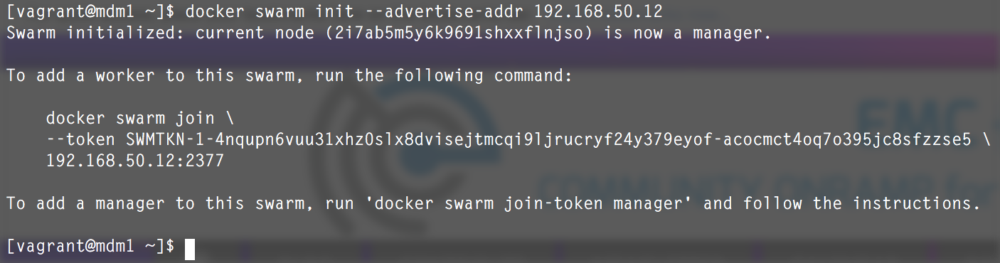
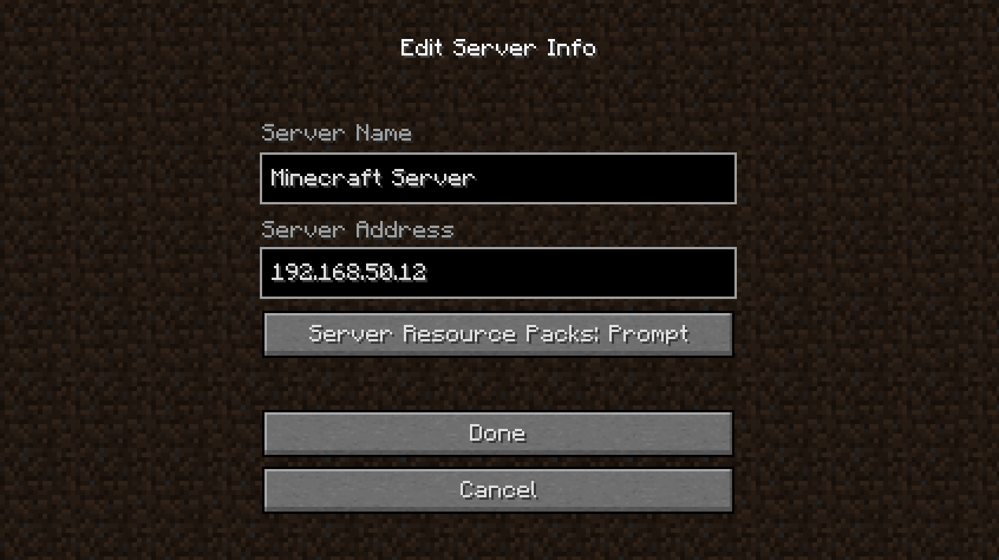
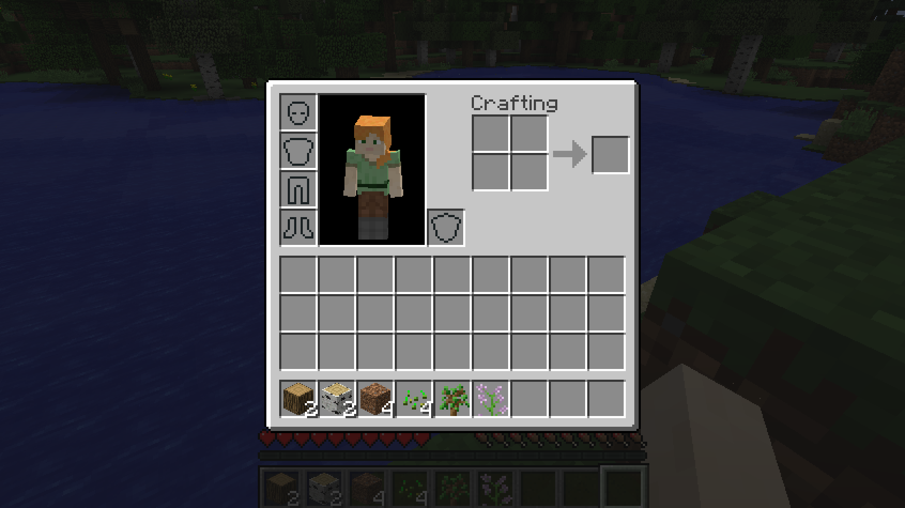
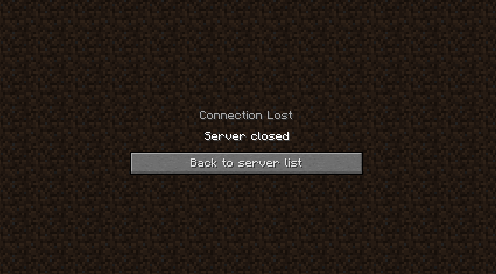
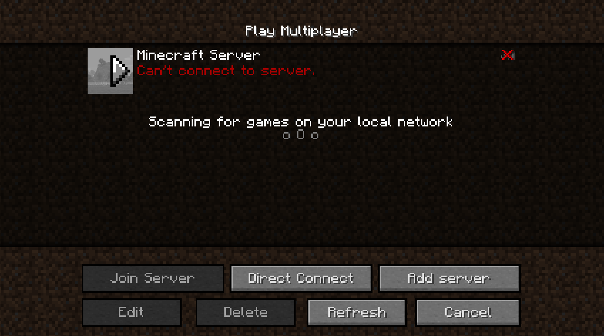

# Storage Persistence and Failover with Minecraft using REX-Ray and Docker Swarm Mode

{code} has been showing demos with REX-Ray using applications like Redis, Postgres and other databases. However, recovering a few tables isn't *that* exciting. This demo will show how to persist [Minecraft](https://minecraft.net/en/) with Docker Swarm Mode and Docker Service.


### Prerequisites

- A valid login to the [Minecraft network](https://minecraft.net/en/store/minecraft/?ref=ld#buy) - ($26.95 USD)
- A multi-node computing environment with a storage platform that is compatible with [REX-Ray](https://github.com/emccode/rexray). [Examples](https://github.com/codedellemc/demo#environment-quickstarts)
- [REX-Ray must be installed](http://rexray.readthedocs.io/en/latest/) on each node and [configured with the preemption flag](http://libstorage.readthedocs.io/en/stable/user-guide/config/#volume-configuration)
- Docker 1.12+ must be installed on each node

### Environment
This guide was written for use by the [Vagrant ScaleIO](https://github.com/emccode/vagrant/tree/master/scaleio) ([setup instructions](https://github.com/codedellemc/demo/tree/master/setup-scaleio-vagrant)) deployment because the IP addresses never change. However, any REX-Ray compatible storage platform can be used and disregard instructions for MDM1, MDM2, and TB usage. 

### Create the Docker Swarm Cluster

All nodes should have Docker 1.12.1 or higher installed to take advantage of the the built-in [Swarm Mode](https://docs.docker.com/engine/swarm/) capability. 

Initialize the Docker Swarm cluster by setting your first machine as a Swarm Manager. In this case, MDM1 is the ScaleIO API gateway and will be used as the manager to make sure it doesn't get an unexpected workload.
```
$ docker swarm init --advertise-addr 192.168.50.12
```



The output of this command will display a new command to create Swarm Workers. Copy and paste that command with the unique key to MDM2 and TB.

```
$ docker swarm join \
    --token <unique token> \
    192.168.50.12:2377
```

### Pre-Create Volumes

This example will use one of the most highly rated [Minecraft Docker Images](https://github.com/itzg/dockerfiles/tree/master/minecraft-server). Reading through the repo will give instructions on deploying it as a standard Docker container, but will not take advantage of Swarm. Reading the [Dockerfile](https://github.com/itzg/dockerfiles/blob/master/minecraft-server/Dockerfile), it shows the line: `VOLUME ["/data","/mods","/config","/plugins","/home/minecraft"]`, which are directories that need to persist.

Two options can be used to create the volumes. From the terminal session of MDM1, choose one of the following:

1. Docker Volume 

  ```
$ docker volume create -d rexray --name mc_data --opt=size=5 && \
docker volume create -d rexray --name mc_mods --opt=size=5 && \
docker volume create -d rexray --name mc_config --opt=size=5 && \
docker volume create -d rexray --name mc_plugins --opt=size=5 && \
docker volume create -d rexray --name mc_home_minecraft --opt=size=5
  ```

2. REX-Ray CLI
  ```
$ sudo rexray volume create mc_data --size=5 && \
sudo rexray volume create mc_mods --size=5 && \
sudo rexray volume create mc_config --size=5 && \
sudo rexray volume create mc_plugins --size=5 && \
sudo rexray volume create mc_home_minecraft --size=5
  ```

Any node that has access to the storage platform (or in this case, is a part of the ScaleIO cluster) will have access to the pre-created volumes:

```
$ docker volume ls
```

### Start the Service
Most Docker containers use the `docker run` command to create containers. With Docker 1.12+ using Swarm mode, this has changed to `docker service create`. 

Much of the same syntax used in the former `docker run` for exposing ports and using environment variables still exists. The main changes are as follows:

- `--replicas` for how many instances of a container should be running within the Swarm. For RW access to the data volumes, only 1 replica should be used
- `--mount` replaces the `--volume` flag and sets the source volume from the node, target of the directory in the container, and optional use of the volume-driver
- `--constraint` is used in this example to ensure the container will always run on MDM2 or TB.  

From the terminal session of a Swarm Manager (MDM1):

```
$ docker service create --replicas 1 --name mc -p 25565:25565 -e EULA=TRUE \
--mount type=volume,target=/data,source=mc_data,volume-driver=rexray \
--mount type=volume,target=/mods,source=mc_mods,volume-driver=rexray \
--mount type=volume,target=/config,source=mc_config,volume-driver=rexray \
--mount type=volume,target=/plugins,source=mc_plugins,volume-driver=rexray \
--mount type=volume,target=/home/minecraft,source=mc_home_minecraft,volume-driver=rexray \
--constraint 'node.role == worker' itzg/minecraft-server
```

View the status of the deployment and verify which node the container has been deployed:
```
$ docker service ps mc
```


**NOTE:** If this demo is in front of an audience, download the docker image on MDM2 and TB prior to presenting:
```
$ docker pull itzg/minecraft-server
```

### Watch the logs
In the previous step, `$ docker service ps mc` was used to determine placement. Once the `CURRENT STATE` is changed to `Starting`, open a terminal session to the node where the Minecraft container is running. 

Get the container ID and follow the logs:
```
$ docker ps
$ docker logs -f <container id>
```

Watch the progress as the world is being built and ready for game play.


### Join the Game and Play
Remember, a valid login to the [Minecraft network](https://minecraft.net/en/store/minecraft/?ref=ld#buy) ($26.95 USD) is required.

Open Minecraft and join a Multiplayer game


Click on `Add Server` and Add the IP address of any node in the Swarm cluster. Docker Swarm will use forwarding to route the application to the node that has the container. However, if the node is down, then it cannot route. For this scenario, it's best to use the IP address of a Swarm Manager (MDM1):



Click on the server and `Join Server`


Jump back to the terminal to view new log entries of players joining the game. If the instance is running on a public cloud, anyone can access and play.


Run around within the game and add pieces to inventory. The inventory and game state is what will be used to demonstrate persistence. 



### Failover and Persistence

Open a new terminal window and SSH session to the node where the Minecraft container is running.

```
$ vagrant ssh <mdm2 or tb>
```

In this particular scenario, shutting down or killing 1/3rd of a ScaleIO cluster would make meta-data unavailable. Therefore, stopping the Docker service will *simulate* a failure. 

```
$ sudo systemctl stop docker
```

If this demo is performed with VirtualBox, AWS, or any other Non Software Defined Storage solution, power off the node to demonstrate a failure.

Minecraft will be disconnected from the server automatically.




On a Swarm Manager node (MDM1), view the status of the service see the container automatically fail over to a new node:
```
$ docker service ls
$ docker service ps mc
```


Once the `CURRENT STATE` is changed to `Starting` on a different node, follow the logs and wait for the areas to spawn. This will be much faster than the first time since the data needed for the application is saved in the persistent volume.


Click on the refresh button and join back in the game to see the inventory has persisted! Editing the node IP Address isn't necessary because Docker Swarm Mode will automatically route it to the node with the running container. 


## Contribution

Create a fork of the project into your own repository. Make all your necessary changes and create a pull request with a description on what was added or removed and details explaining the changes in lines of code. If approved, project owners will merge it.


## Support

Please file bugs and issues on the GitHub issues page for this project. This is
to help keep track and document everything related to this repo. For general
discussions and further support you can join the [{code} Community slack
channel](http://community.thecodeteam.com/). The code and documentation are
released with no warranties or SLAs and are intended to be supported through a community driven process.