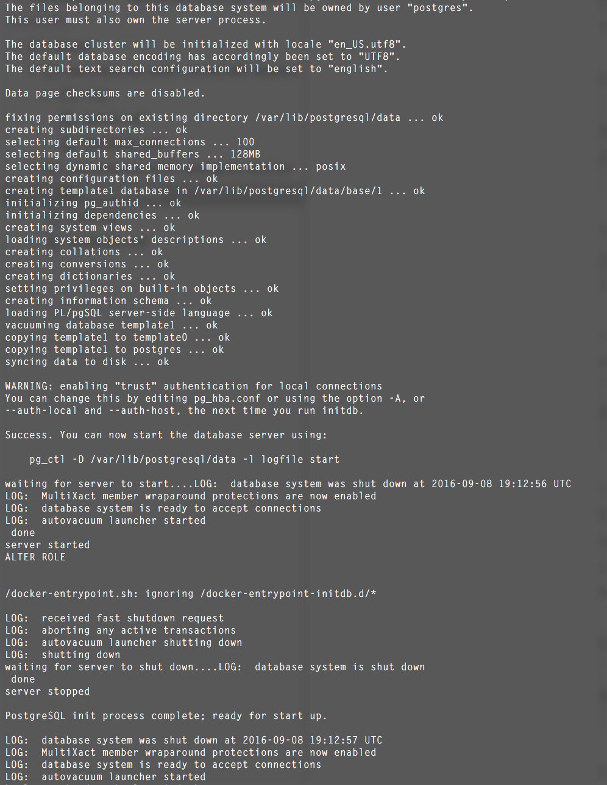
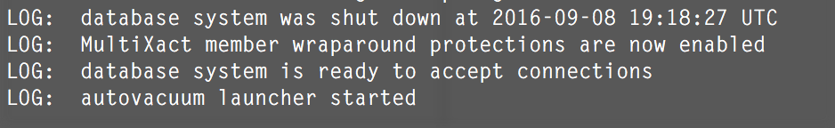
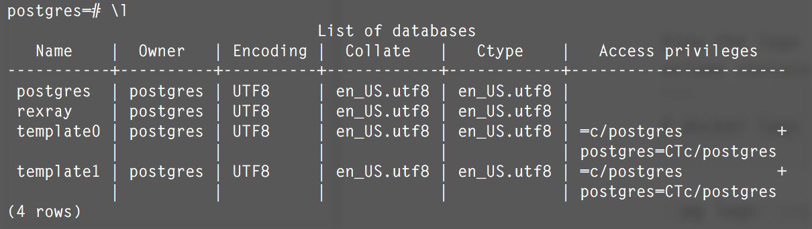

# Storage Persistence with Postgres (PostgreSQL) using REX-Ray

Recovering tables! 

This scenario is not going to use an orchestrator and demonstrates the ability to do manual recovery.

### Prerequisites

- A multi-node computing environment with a storage platform that is compatible with [REX-Ray](https://github.com/emccode/rexray). [Examples](https://github.com/codedellemc/demo#environment-quickstarts)
- [REX-Ray must be installed](http://rexray.readthedocs.io/en/latest/) on each node and [configured with the preemption flag](http://libstorage.readthedocs.io/en/stable/user-guide/config/#volume-configuration)
- Docker 1.12+ must be installed on each node

### Pre-Create Volumes

Examine the [Dockerfile used for Postgres](https://hub.docker.com/_/postgres/) and look at the `VOLUME` line. This represents the volume necessary to persist data:
```
VOLUME /var/lib/postgresql/data
```

Only one path is necessary for this particular database. Two options can be used to create the volumes. From the terminal session of any host, choose one of the following (`size` is an optional parameter):

1. Docker Volume 

  ```
$ docker volume create -d rexray --name pg_data --opt=size=10
  ```

2. REX-Ray CLI
  ```
$ sudo rexray volume create --volumename pg_data --size=10
  ```

All hosts will have access to this volume.
```
$ docker volume ls
$ docker volume inspect pg_data
```

### Start the Container
Docker 1.12+ has the ability to use `docker service create` which takes advantage of Swarm orchestration and networking. This demonstration will use `docker run` which is simply running a container without any additional features.

On the first host, start and run the container:
```
$ docker run -dit --name pg -e POSTGRES_PASSWORD=mysecretpassword --volume-driver=rexray -v pg_data:/var/lib/postgresql/data postgres
```

View the logs of the server:
```
$ docker logs pg
```

The logs will finish with `LOG:  autovacuum launcher started`. The server has completed its initial setup and is ready to accept incoming connections.



**NOTE:** If this demo is in front of an audience, download the docker image on all hosts prior to presenting:
```
$ docker pull postgres
```

### Add a new database
Using `docker exec`, go into the container and add a new database

```
$ docker exec -it pg sh
# su - postgres
# psql
# CREATE DATABASE rexray;
# \l
```

### Stop and remove the container
Exit out of the container using `ctrl+p ctrl+q` to keep the TTY session alive.

Display all running containers:
```
$ docker ps
```

Stop the container:
```
$ docker stop pg
```

Display all containers, running or stopped:
```
$ docker ps -a
```

Remove the container:
```
$ docker rm pg
```

Verify all containers are removed:
```
$ docker ps -a
```

At this point, there is no trace of a container that existed that ran our Postgres image. Containers are an ephemeral technology and their nature to be disposable.

### Start a container on a different host

On a different host that also has access to the storage platform, use the same command as before:
```
$ docker run -dit --name pg -e POSTGRES_PASSWORD=mysecretpassword --volume-driver=rexray -v pg_data:/var/lib/postgresql/data postgres
```

View the logs to see a much more truncated set up time since the persisted volume contains all the data.
```
$ docker logs pg
```



Verify the newly created database still exists:
```
$ docker exec -it pg sh
# su - postgres
# psql
# \l
```



## Contribution

Create a fork of the project into your own repository. Make all your necessary changes and create a pull request with a description on what was added or removed and details explaining the changes in lines of code. If approved, project owners will merge it.


## Support

Please file bugs and issues on the GitHub issues page for this project. This is to help keep track and document everything related to this repo. For general discussions and further support you can join the [{code} by Dell EMC Community slack channel](http://community.codedellemc.com/). The code and documentation are released with no warranties or SLAs and are intended to be supported through a community driven process.