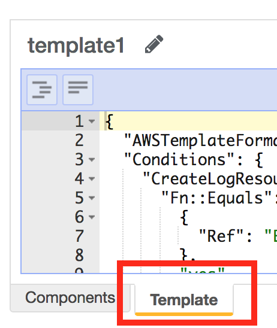
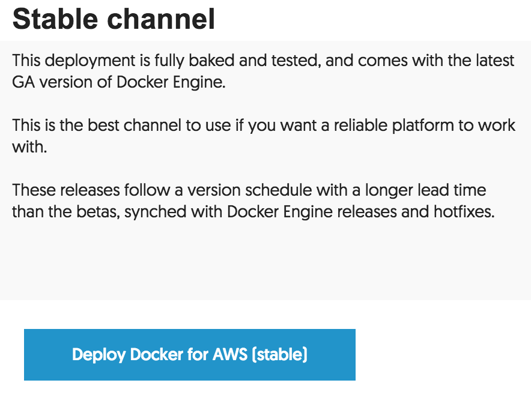
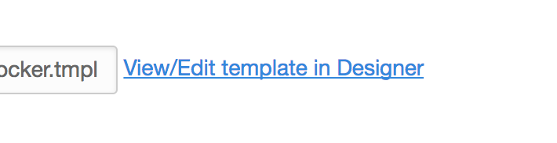
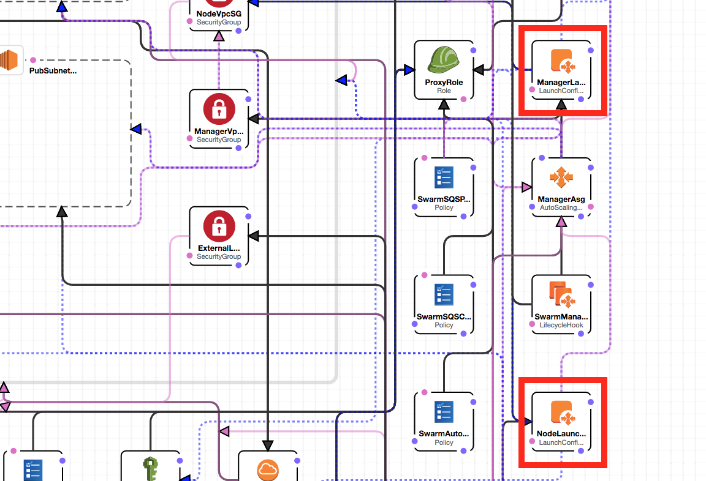
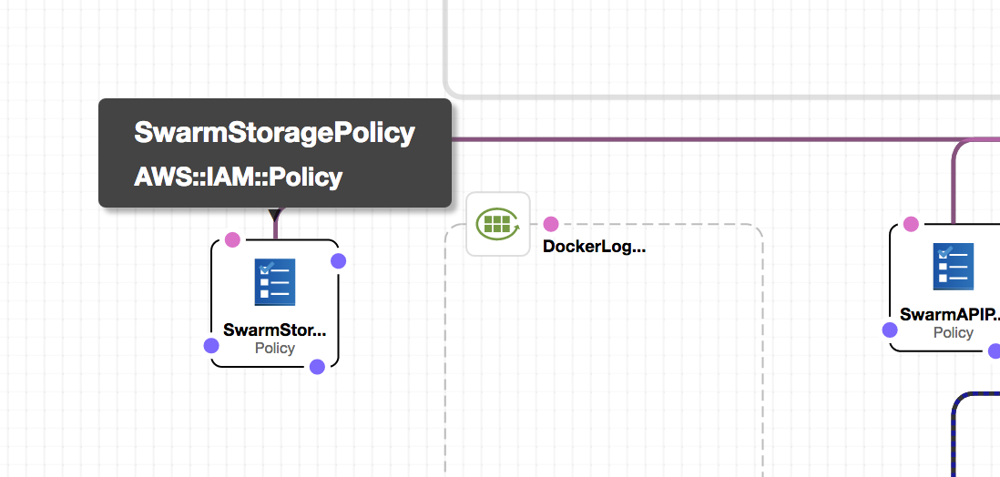
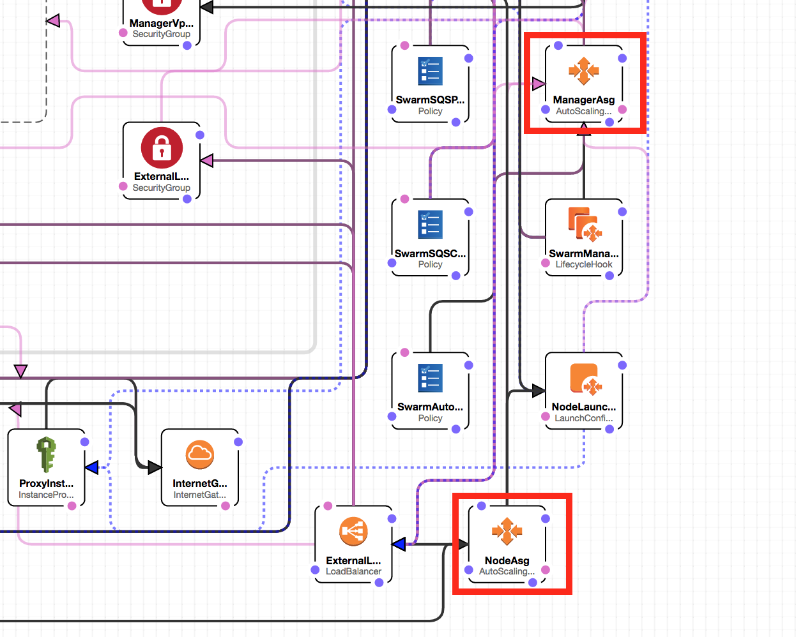
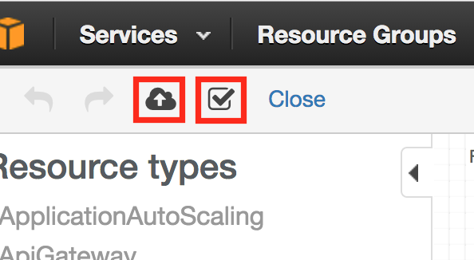

# Install REX-Ray as a Plugin on Docker for AWS (Cloudformation)

Bring persistent volume functionality to [Docker for AWS]
(https://docs.docker.com/docker-for-aws/) with REX-Ray. Customizing the
Cloudformation template allows automated installations of REX-Ray to AWS AutoScaling Groups and access to EBS volumes.

This is currently considered **EXPERIMENTAL** and not for production use.

---


## View the Completed Template

Skip all the steps and replace the default template with the [Docker for AWS with
REX-Ray and EBS Storage Cloudformation Template](DockerWithREXRay.tmpl)

  

## Edit The Template

1. Deploy [Docker for AWS](https://docs.docker.com/docker-for-aws/). Select Stable

  

2. Click on View/Edit Template in Designer

  

3. Both the `ManagerLaunchConfig1` and `NodeLaunchConfig1` need the following
command added so the plugin is installed during deployment. This command will
automatically install the `rexray/ebs` plugin, set the pre-emption flag to true,
and set the keys to `""` which allow the use of IAM roles.

  

  ```
  "yes | docker plugin install rexray/ebs REXRAY_PREEMPT=true EBS_SECRETKEY=\"\"
  EBS_ACCESSKEY=\"\"\n"
  ```

4. The IAM role is critical to make sure the host themselves are given the
proper permissions for volume administration. The [libStorage documentation](http://libstorage.readthedocs.io/en/stable/user-guide/storage-providers/#troubleshooting_1) specifies all the permissions needed for EBS and EFS access. It’s not necessary to include the EFS roles but it’s favorable to include so it’s possible to use Amazon Elastic File Storage (EFS) when an official REX-Ray plugin is available. IAM roles can only be applied to hosts on launch and cannot be applied after creation.

  

  ```
    "SwarmStoragePolicy": {
      "Type": "AWS::IAM::Policy",
      "Properties": {
        "PolicyDocument": {
          "Statement": [
            {
              "Action": [
                "elasticfilesystem:CreateFileSystem",
                "elasticfilesystem:CreateTags",
                "elasticfilesystem:DeleteTags",
                "elasticfilesystem:CreateMountTarget",
                "elasticfilesystem:DescribeFileSystems",
                "elasticfilesystem:DescribeMountTargets",
                "elasticfilesystem:DeleteMountTarget",
                "elasticfilesystem:DeleteFileSystem",
                "ec2:AttachVolume",
                "ec2:CopySnapshot",
                "ec2:CreateNetworkInterface",
                "ec2:CreateSnapshot",
                "ec2:CreateTags",
                "ec2:CreateVolume",
                "ec2:DeleteNetworkInterface",
                "ec2:DeleteSnapshot",
                "ec2:DeleteVolume",
                "ec2:DescribeAvailabilityZones",
                "ec2:DescribeInstances",
                "ec2:DescribeNetworkInterfaces",
                "ec2:DescribeSnapshotAttribute",
                "ec2:DescribeSnapshots",
                "ec2:DescribeSubnets",
                "ec2:DescribeTags",
                "ec2:DescribeVolumeAttribute",
                "ec2:DescribeVolumeStatus",
                "ec2:DescribeVolumes",
                "ec2:DetachVolume",
                "ec2:ModifySnapshotAttribute",
                "ec2:ModifyVolumeAttribute"
              ],
              "Effect": "Allow",
              "Resource": "*"
            }
          ],
          "Version": "2012-10-17"
        },
        "PolicyName": "swarm-storage-policy",
        "Roles": [
          {
            "Ref": "ProxyRole"
          }
        ]
      },
      "Metadata": {
        "AWS::CloudFormation::Designer": {
          "id": "fbf9e09d-b18f-4a61-8619-ea82bcd10ade"
        }
      },
      "DependsOn": "ProxyRole"
    }
  ```

5. The last edit required is to pin hosts being deployed into a single availability zone. By default, Docker for AWS will deploy both manager and worker nodes in the same region but across multiple availability zones. This increases the high availability of a container because a failed node will trigger the restart a different host which may be in a different availability zone. However, a limitation of EBS is that a volume is only accessible to hosts in the same availability zone. Pre-emption is the benefit REX-Ray brings to this single availability zone that will forcefully detach a volume from a failed host and mount it to a new host requesting access. This feature brings high availability to the container with a persistent volume. Edit both the Manager and Node Auto Scaling Group’s `VPCZoneIdentifier` and remove the multiple availability zones so only one remains:

  

  ```
  "VPCZoneIdentifier": [
            {
              "Fn::If": [
                "HasOnly2AZs",
                {
                  "Fn::Join": [
                    ",",
                    [
                      {
                        "Ref": "PubSubnetAz1"
                      }
                    ]
                  ]
                },
                {
                  "Fn::Join": [
                    ",",
                    [
                      {
                        "Ref": "PubSubnetAz1"
                      }
                    ]
                  ]
                }
              ]
            }
          ]
  ```

6. Validate the template by clicking on the check box, and then deploy it using
the cloud button. Follow the CloudFormation template to finish deployment. 

  

7. Create a new persistent application from the [Application Demo]
(https://github.com/codedellemc/labs#application-demo) section. 

  SSH is only available to Master nodes. 

  ```
  $ ssh -i “mypem.pem" docker@PublicIPorDNS
  ```

  Create a new volume and service and test it out.

  ```
  ~ $ docker plugin ls
  ID                  NAME                DESCRIPTION              ENABLED
  da7fee8a2354        rexray/ebs:latest   REX-Ray for Amazon EBS   true
  ~ $ docker volume create -d rexray/ebs --name yolo --opt=size=32
  yolo
  ~ $ docker service create --replicas 1 --name pg -e POSTGRES_PASSWORD=mysecretpassword \
  --mount type=volume,target=/var/lib/postgresql/data,source=yolo,volume-driver=rexray/ebs \
  --constraint 'node.role == worker' postgres
  hzn42hxssr2hfs7ehjtj9cgyl
  ~ $ docker service ls
  ID            NAME  MODE        REPLICAS  IMAGE
  hzn42hxssr2h  pg    replicated  0/1       postgres:latest
  ~ $ docker service ps pg
  ID            NAME  IMAGE            NODE                         DESIRED STATE  CURRENT STATE           ERROR  PORTS
  m0uctyav98fw  pg.1  postgres:latest  ip-172-31-7-71.ec2.internal  Running        Running 22 seconds ago
  ```

## TroubleShooting

Redeploy and copy and paste the [Docker for AWS with
REX-Ray and EBS Storage Cloudformation Template](DockerWithREXRay.tmpl) into
the Template tab


